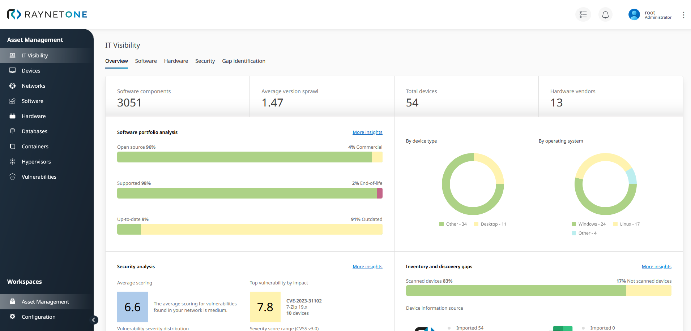
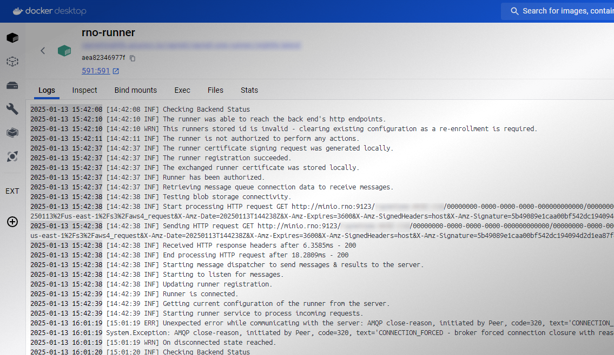
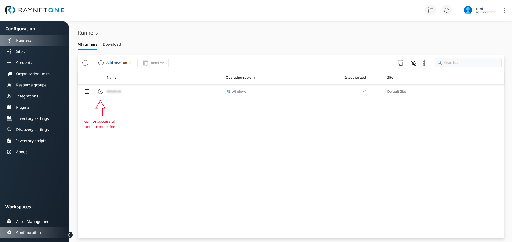

# Raynet One

True IT asset visibility at your fingertips! Get valuable insights into your devices by
collecting device inventory. Get to know security issues lurking in the depths of
your IT landscape and solve them with concrete evidence. Build a stable network device
management strategy using rules and automation. Revolutionize your way of
device data collection by making use of an easy and powerful inventory scripting
system. Design advanced REST-based data management strategies, overviews and
service endpoints. Plan ahead your IT investments of tomorrow using a strong and complete
device overview. Leverage the powerful list views and become the true master of
your own devices.

## Deploying the Raynet One runner

The Raynet One runner is the gateway to your IT landscape infrastructure. Strategically deploy it to pave
the way to your devices.

### Prerequisites

* [Raynet One](https://raynet.de/raynet-one/)
* [Docker](https://docs.docker.com/get-started/get-docker/)

### Installation

1) Create a new dedicated folder for your runner.
2) Create a new file called "docker-compose.yaml" inside of the folder.
3) Put the following text content into the file.

        version: "1.0"

        services:
          rno-runner:
            container_name: rno-runner
            hostname: runner
            image: raynetgmbh/raynet-one-runner:latest
            restart: always
            volumes:
              - rno_runner_data:/app/data
            environment:
              RunnerDatabaseConfig__Location: /app/data/runner.db
              Logging__LogLevel__Default: Information
              ServiceSettings__BackendServerApiUrl: [BACKENDURL]
              ServiceSettings__EnrollmentToken: [TOKEN]
              ServiceSettings__HearBeatDelaySeconds: 20
              Messaging__Configuration__Protocol: STOMP
              
        volumes:
          rno_runner_data:
      
4) Create a new runner in the Raynet One web interface.
5) Replace \[BACKENDURL\] by the backend server URL and \[TOKEN\] by the runner enrollment token.
6) Start the runner by executing `docker compose up` inside of the folder.
7) Verify the successful runner connection in the web interface.

### Description

You should know about important runner settings. The following describes some of them.

* `ServiceSettings__BackendServerApiUrl`: The endpoint to the Raynet One system used by your runner. There is one backend and one frontend server application.
* `ServiceSettings__EnrollmentToken`: The one-time authentication token issued by the system for runner registration.
* `Messaging__Configuration__Protocol`: Chooses between the `STOMP` and `AMQP` messaging communication protocols.

For more details, visit the full documentation in the Links section below.

## Raynet One API

Open the API folder to find the REST API description files. They are automatically
generated based on all available endpoints.

## Links

* [(c) Raynet GmbH](https://raynet.de)
* [Full documentation](https://docs.raynet.de/raynet-one/cloud/latest/user-guide/en)